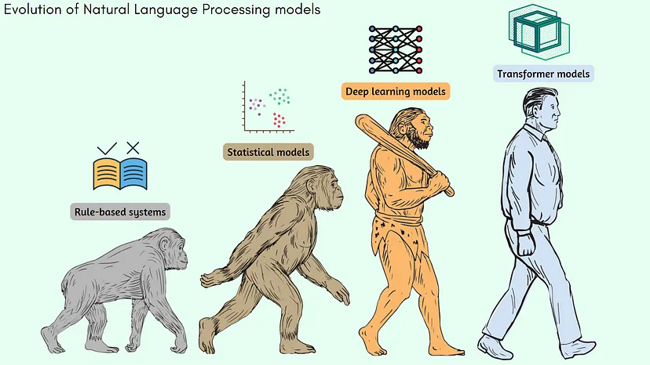
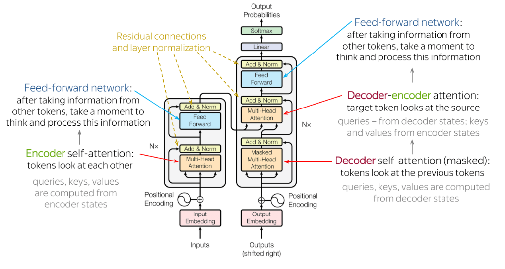
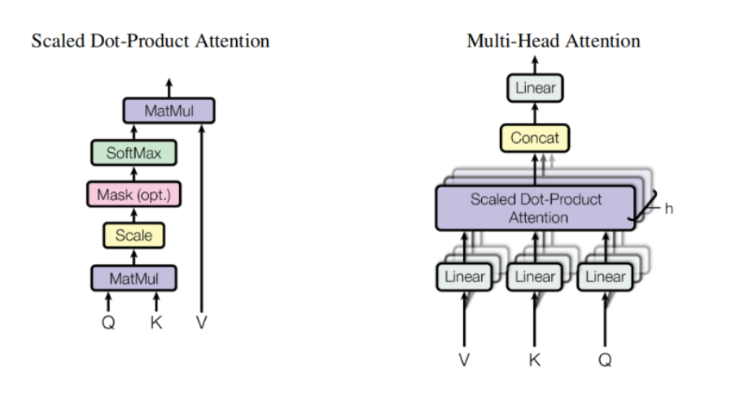
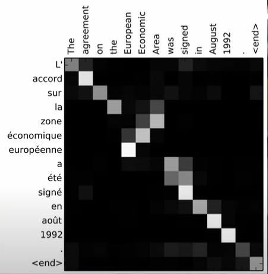

### Rule-Based Systems (1950s — 1960s)
Use-cases: Translation services  
In 1954, IBM conducted research to translate 60 Russian sentences into English using a set of hand-crafted rules.

### Statistical Models (1960s — 2010s)
Algos: Hidden Markov Model (HMM), Text Mining algos (Tokenization, POS tagging, TF-IDF etc.)
Latent Dirichlet Allocation  
Use-cases: Text analysis, Sentiment analysis, Topic modeling, named entity recognition etc.  

### Neural networks and Deep Learning (2000s — 2020s)
Algos: Recurrent Neural Networks (RNNs), Convolutional Neural Networks (CNNs), LSTMs  
Use cases: Language modeling, Word embedding, Sequence to Sequence Learning  

RNNs: predicts the next word through a deep NN using an input of word sequence. They are called recurrent due to the fact that they can have a feedback loop among their input layers.
Use RNN for short-term dependencies and LSTM for long-term dependencies. The basic difference between the architectures of RNNs and LSTMs is that the hidden layer of LSTM is a gated unit or gated cell.  

### Transformer Models (Mid-2010s — present)  
Algos: BERT, GPT  
Use Cases:Language Modeling, Question Answering, Sentiment analysis

#### How do they solve existing problems: 
Traditional RNNs and LSTMs were slow and computationally expensive.  
Transformer models can process all input text through parallelization, rather than one word at a time like RNNs (sequential inputs). Also, they require much less time to re-train. No recurrence. check link below to understand more.  

### Transformer Architecure

Encoder and Decoders: A NN based architecture where Encoder vectorizes the input sequence through positional embedding and attention mechanism, which helps the decoder to focus on the most associated words to generate the text sequence. As the transformers are auto-regressive, they focus on generating next token after reading the preceeding ones. N encoders and N decoders are stacked together to give the best results.  

Works on mainly three principals:  
1. Positional encoding: Encode the location of an entity in a sentence. Transformers use a smart positional encoding scheme, where each position/index is mapped to a vector through sine (even locations) and cosine functions (odd locations) of varying frequencies. Hence, the output of the positional encoding layer is a matrix with varying positional frequencies at each word embedding location.  

2. Attention: Attention refers to the ability of a transformer model to attend to different parts of another sequence when making predictions.  

3. Self attention: self-attention refers to the the same sequence which is currently being encoded. Self-attention allows us to look at the whole context of our sequence while encoding each of the input elements.  

Consider the sentence — "Bark is very cute and he is a dog". Here the word He is related to 'Bark' more than the adjacent words. So, proximity is not always relevant but context is more relevant in a sentence. This approach of adding some context to the words in a sentence is known as Self-Attention. Check the link below to understand it Mathmatically in the form of dot product of vectors.  

In a Multi headed attention, all the words are compared against a specific word while under the Masked headed attention, only the words prior to a specific word are compared.  

References:
1. How GPT model works? N token in, 1 token out: https://towardsdatascience.com/how-gpt-models-work-b5f4517d5b5
2.1 Positional encoding: https://machinelearningmastery.com/a-gentle-introduction-to-positional-encoding-in-transformer-models-part-1/
2.2 Understanding sin and cosine functions: https://datascience.stackexchange.com/questions/51065/what-is-the-positional-encoding-in-the-transformer-model
3. Self-attention mathematics and How transformer solves the RNN challenges: https://towardsdatascience.com/all-you-need-to-know-about-attention-and-transformers-in-depth-understanding-part-1-552f0b41d021#4c16
4. Attention vs self-attention: https://towardsdatascience.com/demystifying-efficient-self-attention-b3de61b9b0fb#:~:text=Self%2Dattention%20is%20a%20specific,sequence%20learn%20information%20about%20itself.

videos
1. Transformers: https://www.youtube.com/watch?v=_UVfwBqcnbM&list=PLoCRvphlpXhibn-wkQw7HUQ17eSj2Xwkh&index=13&ab_channel=AssemblyAI
2. Attention: https://www.youtube.com/watch?v=4Bdc55j80l8&ab_channel=TheA.I.Hacker-MichaelPhi

## Others
- Why Attention mech didn't work With RNN, LSTM: with the attention mechanism, the LLMs could have infinite reference window of reference text while with RNN the reference window was smaller due to it's architecture
- 