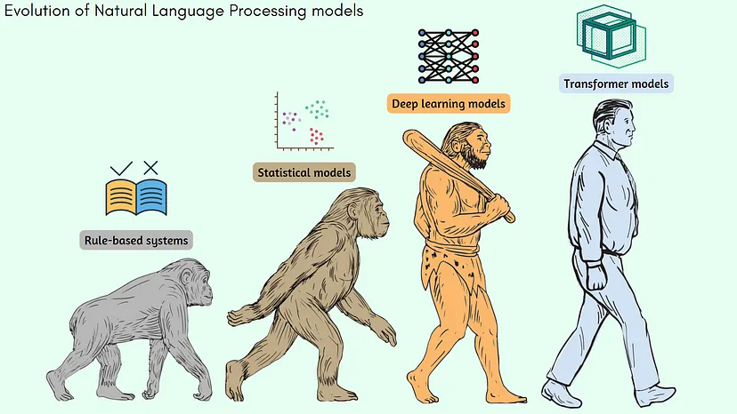
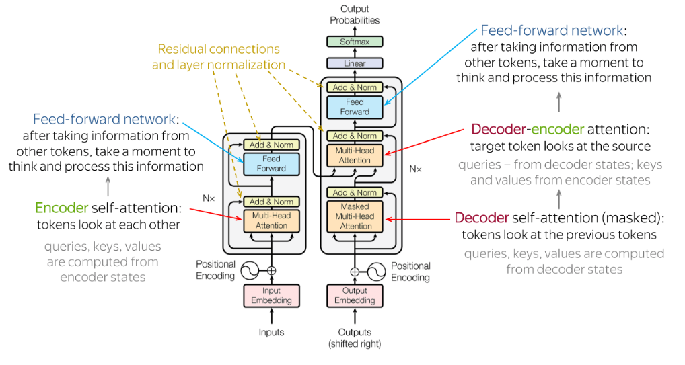

### Rule-Based Systems (1950s — 1960s)
Use-cases: Translation services  
In 1954, IBM conducted research to translate 60 Russian sentences into English using a set of hand-crafted rules.

### Statistical Models (1960s — 2010s)
Algos: Hidden Markov Model (HMM), Text Mining algos (Tokenization, POS tagging, TF-IDF etc.)
Latent Dirichlet Allocation  
Use-cases: Text analysis, Sentiment analysis, Topic modeling, named entity recognition etc.  

### Neural networks and Deep Learning (2000s — 2020s)
Algos: Recurrent Neural Networks (RNNs), Convolutional Neural Networks (CNNs), LSTMs  
Use cases: Language modeling, Word embedding, Sequence to Sequence Learning  

### Transformer Models (Mid-2010s — present)  
Algos: BERT, GPT  
Use Cases:Language Modeling, Question Answering, Text Generation  

#### How do they solve existing problems: 
Traditional RNNs were slow and computationally expensive.  
Transformer models can process all input text through parallelization, rather than one word at a time like RNNs (sequential inputs). Also, they require much less time to re-train. No recurrence. check link below to understand more. 

Works on mainly three principals:  
1. Positional encoding: Encode the location of an entity in a sentence. Transformers use a smart positional encoding scheme, where each position/index is mapped to a vector. Hence, the output of the positional encoding layer is a matrix  

2. Attention: Tackled through a correlation metrics as explained in the french to english translation of 'European Economics'    

3. Self attention: Consider the sentence — "Bark is very cute and he is a dog". Here the word He is related to 'Bark' more than the adjacent words. So, proximity is not always relevant but context is more relevant in a sentence. This approach of adding some context to the words in a sentence is known as Self-Attention. Check the link below to understand it Mathmatically in the form of dot product of vectors.  

### Transformer Architecure

References:
1. How GPT model works? N token in, 1 token out: https://towardsdatascience.com/how-gpt-models-work-b5f4517d5b5
2. Positional encoding: https://machinelearningmastery.com/a-gentle-introduction-to-positional-encoding-in-transformer-models-part-1/
3. Self-attention mathematics and How transformer solves the RNN challenges: https://towardsdatascience.com/all-you-need-to-know-about-attention-and-transformers-in-depth-understanding-part-1-552f0b41d021#4c16
4. Transformer best video explanation: https://www.youtube.com/watch?v=_UVfwBqcnbM&list=PLoCRvphlpXhibn-wkQw7HUQ17eSj2Xwkh&index=13&ab_channel=AssemblyAI

